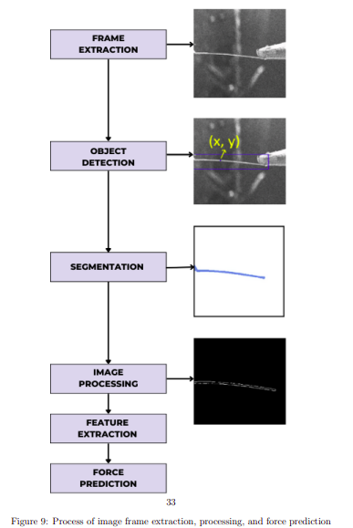
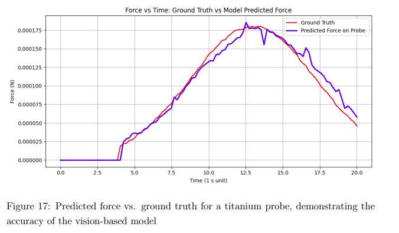
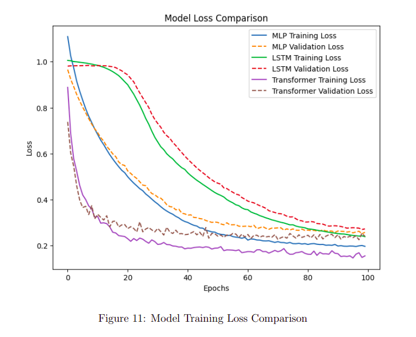
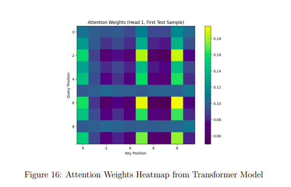
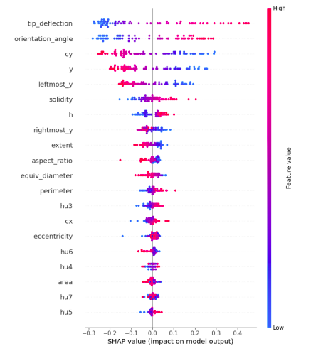
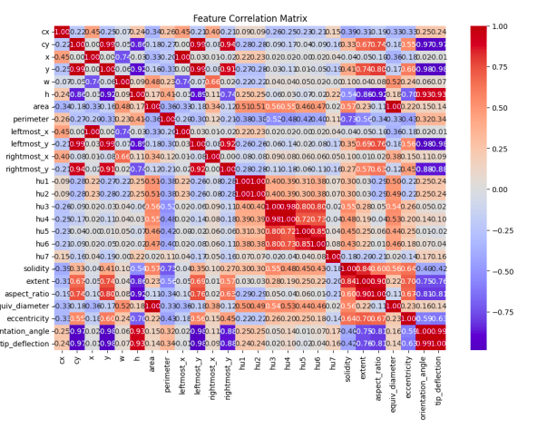

# Vision-Based Force Estimation from SEM Probe Deformation

A computer vision and deep learning framework for estimating micro/nanoscale forces by analyzing probe deformation in Scanning Electron Microscope (SEM) video data.

---

# Overview

Measuring forces at the micro–nano scale is challenging because traditional sensors such as strain gauges or piezoresistive cantilevers introduce additional complexity, noise, or intrusive instrumentation.

This project proposes a **vision-based force sensing system** that estimates the applied force by analyzing deformation of a micro-probe captured in SEM video frames.

Instead of relying on physical force sensors, the system learns the relationship between **visual deformation features and applied forces** using machine learning models.

---

# Pipeline



The full pipeline consists of the following stages:

1. Frame extraction from SEM video
2. Probe detection using YOLOv5
3. Probe segmentation using SAM2
4. Mask processing and contour extraction
5. Geometric feature extraction
6. Machine learning force prediction

Pipeline summary:

```
SEM Video
   ↓
Probe Detection (YOLOv5)
   ↓
Segmentation (SAM2)
   ↓
Binary Probe Mask
   ↓
Contour Detection
   ↓
Feature Extraction
   ↓
ML Models (MLP / LSTM / Transformer)
   ↓
Force Prediction
```

---

# Features Extracted

The following geometric features are extracted from the probe contour:

* centroid coordinates
* bounding box parameters
* contour area
* perimeter
* Hu moments
* convex hull solidity
* extent
* aspect ratio
* equivalent diameter
* eccentricity
* orientation angle
* **tip deflection**

Tip deflection acts as the **primary physical indicator of applied force**.

---

# Models Used

Three machine learning architectures were implemented:

### Feedforward Neural Network (MLP)

Fully connected network used as a baseline model.

### Long Short-Term Memory (LSTM)

Captures temporal relationships between probe deformation across frames.

### Transformer Model

Uses self-attention to model temporal dependencies and complex feature interactions.

The **Transformer model achieved the best performance**.

---

# Example Results

Predicted vs actual force comparison:



Training loss curves:



Transformer attention heatmap:



Transformer Feature Importance:



Feature correlation matrix:



---

# Repository Structure

```
vision-based-force-estimation
│
├── README.md
├── requirements.txt
│
├── src
│   ├── run_pipeline.py
│   │
│   ├── preprocessing
│   │   └── probe_mask_extraction.py
│   │
│   ├── feature_engineering
│   │   └── feature_extraction.py
│   │
│   ├── models
│   │   ├── train_models.py
│   │   ├── mlp_model.py
│   │   └── transformer_model.py
│   │
│   └── analysis
│       └── analysis_plots.py
│
├── results
│   ├── force_prediction.png
│   ├── training_loss.png
│   ├── attention_heatmap.png
│   └── correlation_matrix.png
│
├── assets
│   └── pipeline.png
│
└── demo
    └── probe_deflection.gif
```

---

# Installation

Clone the repository

```
git clone https://github.com/YOUR_USERNAME/vision-based-force-estimation
cd vision-based-force-estimation
```

Install dependencies

```
pip install -r requirements.txt
```

---

# Running the Pipeline

Run the full pipeline:

```
python src/run_pipeline.py
```

This executes the following steps:

1. Probe mask extraction
2. Feature extraction
3. Dataset generation
4. Model training
5. Evaluation and visualization

---

# Dataset

The SEM dataset used in this project is **not publicly shared**.

Reasons:

* Data was collected from a laboratory SEM system
* Experimental datasets belong to institutional research infrastructure

Therefore this repository includes:

* Code implementation
* Result visualizations
* Example pipeline demonstration

But **does not include raw SEM data**.

---

# Applications

Vision-based force sensing has applications in:

* nanorobotic manipulation
* MEMS and NEMS testing
* AFM probe characterization
* bio-cellular mechanics
* SEM-based nanomanipulation

---

# Author

Gaurav Ramteke
Indian Institute of Technology Kharagpur

---

# License

MIT License
